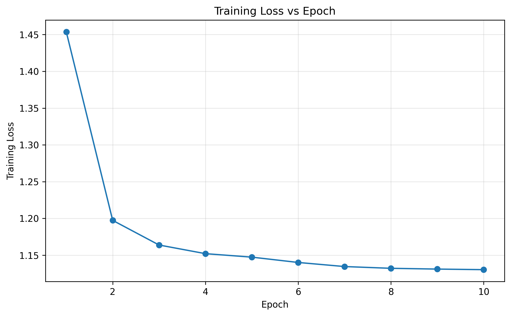
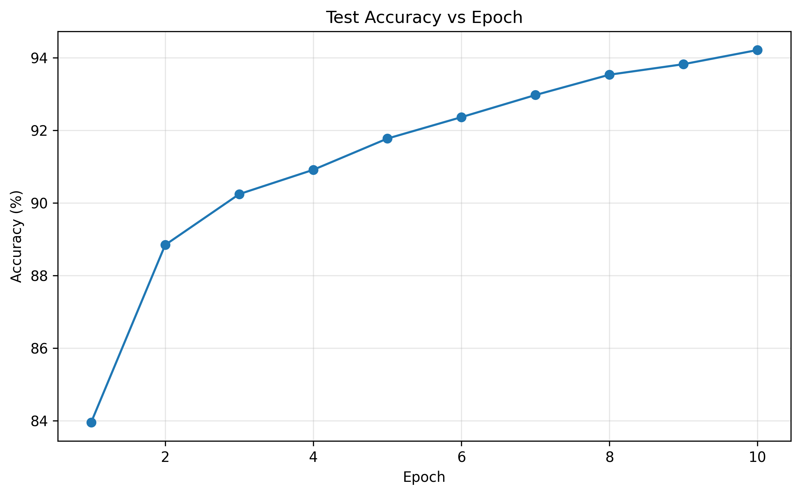
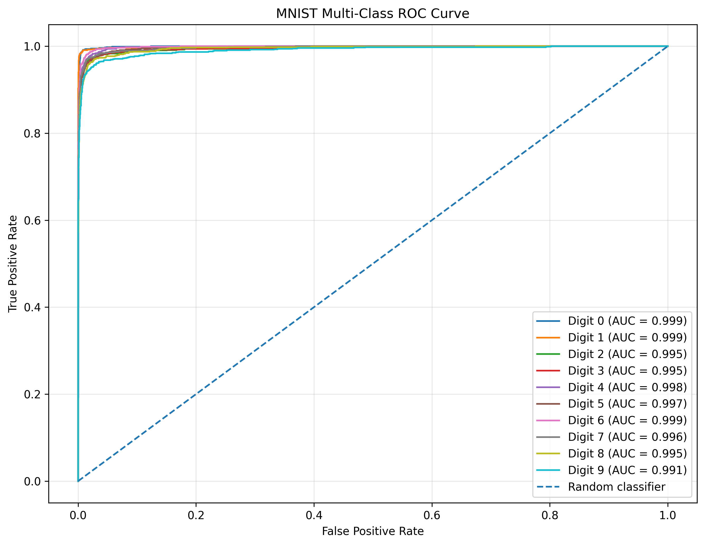

# MNIST Neural Network — From Scratch

A handwritten digit recognition neural network built from scratch using **Python and NumPy**, without using high-level deep learning frameworks such as TensorFlow or PyTorch.

The goal of this project was not just to recognize digits, but to understand what actually happens inside a neural network — from forward propagation and activation functions to backpropagation and weight updates.

---

## Overview

This project implements a fully connected Deep Neural Network (DNN) capable of classifying handwritten digits from **0 to 9**.

The network takes a `28 × 28` grayscale image as input, processes it through two hidden layers, and produces probabilities for all 10 digit classes.

## How to Run

```bash
git clone https://github.com/FlareSome/Neural_Networks.git
cd Neural_Networks
pip install -r requirements.txt
cd notebook
jupyter notebook/MNIST_NN.ipynb
```

### Architecture

```text
  Input Image
       │
       │ 28 × 28 = 784 pixels
       ▼
┌─────────────┐
│ Input Layer │
│    784      │
└──────┬──────┘
       │
       ▼
┌─────────────┐
│ Hidden Layer│
│    128      │
│    ReLU     │
└──────┬──────┘
       │
       ▼
┌─────────────┐
│ Hidden Layer│
│     64      │
│    ReLU     │
└──────┬──────┘
       │
       ▼
┌─────────────┐
│ Output Layer│
│     10      │
│   Softmax   │
└─────────────┘
       │
       ▼
 Predicted Digit
```

## Training Loss

Training loss measures how far the model's predictions are from the expected outputs during training. The loss is calculated after each epoch to track the learning process.

<p align="center">
  
</p>

A downward trend in the loss indicates that the neural network is gradually improving its predictions on the training data.

## Test Accuracy

Test accuracy represents the percentage of handwritten digits correctly classified by the neural network on the test dataset after each epoch.

<p align="center">
  
</p>

An increasing accuracy indicates that the model is improving its ability to recognize and classify unseen handwritten digits.

## Receiver Operating Characteristic (ROC) Curve

The Receiver Operating Characteristic (ROC) curve evaluates the model's ability to distinguish each digit from the remaining classes. Since MNIST is a multi-class classification problem, a one-vs-rest approach is used to generate a separate ROC curve for each digit.

<p align="center">
  
</p>

The Area Under the Curve (AUC) provides a numerical measure of class discrimination. An AUC closer to 1 indicates that the model can effectively distinguish the corresponding digit from the other classes.

## Acknowledgements

This project was developed as a hands-on implementation of a neural network for handwritten digit classification. I referred to the following resources while learning and developing different parts of the project:

- **MNIST Neural Network Implementation** — [YouTube](https://youtu.be/0idoEomDc9E?si=2mFxgEQVKowvtm-6)  
  Used as a reference for understanding the overall neural network implementation and training process.

- **MNIST Neural Network from Scratch using NumPy** — [Kaggle](https://www.kaggle.com/code/wwsalmon/simple-mnist-nn-from-scratch-numpy-no-tf-keras)  
  Referenced for understanding a NumPy-based neural network implementation without TensorFlow or Keras.

- **OpenCV Image Processing** — [YouTube](https://youtu.be/kSqxn6zGE0c?si=UUjpWwaHM4Lh81er)  
  Referenced for image preprocessing and handling custom handwritten digit images using OpenCV.

These resources were used for learning and reference purposes, while the project was adapted, modified, and extended with additional functionality such as training-history visualization, ROC/AUC analysis, and custom handwritten digit testing.
